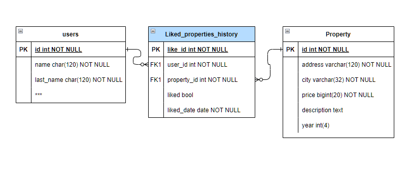

# Servicio Consulta de Inmuebles
- [Servicio Consulta de Inmuebles](#servicio-consulta-de-inmuebles)
  - [Tecnologias del proyecto](#tecnologias-del-proyecto)
  - [Estructura General](#estructura-general)
  - [Descripcion del Microservicio](#descripcion-del-microservicio)
  - [Como ejecutar los test?](#como-ejecutar-los-test)
  - [Como ejecutar el servicio?](#como-ejecutar-el-servicio)
  - [Funcionalidades](#funcionalidades)
    - [Consulta de inmuebles por estado](#consulta-de-inmuebles-por-estado)
    - [Consulta de inmuebles por los datos del mismo](#consulta-de-inmuebles-por-los-datos-del-mismo)
  - [Servicio “Me gusta”](#servicio-me-gusta)

## Tecnologias del proyecto

Este servicio se encuentra desarrollado con las siguientes herramientas

- `Python 3.9` (librerias Core)
    - `http.server`: Servidor Http
    - `unnittest:` Pruebas unitarias
- `SQLAlchemy`:  Conexion a la base de datos
- `MySQL`: Motor de base de datos
- `Docker`: Crear el contenedor del microservicio.

## Estructura General

El proyecto presenta la siguiente estructura

```python
.
├── app
│   ├── config
│   │   ├── config.py
│   │   └── __init__.py
│   ├── database
│   │   ├── database.py
│   │   ├── __init__.py
│   │   └── queries.py
│   ├── __init__.py
│   ├── models
│   │   ├── __init__.py
│   │   └── models.py
│   ├── server
│   │   ├── __init__.py
│   │   ├── microserver.py
│   │   └── router.py
│   ├── service
│   │   ├── __init__.py
│   │   └── services.py
│   ├── urls.py
│   └── views.py
│
├── main.py
├── README.md
├── requirements.dev.txt
├── requirements.prod.txt
└── tests
    ├── __init__.py
    ├── test_config.py
    ├── test_create_app.py
    ├── test_database.py
    ├── test_microserver.py
    ├── test_models.py
    ├── test_routed_views.py
    └── test_services.py
```

Para resolverlo utilice como referencia la forma estructurada de segregar responsabilidad a objetos y metodos de forma similar en la que trabaja flask y fast-api, creando un servidor compuesto de un router para que me permita separar multiples vistas (endpoints). 

## Descripcion del Microservicio

Esta herramienta permite que los usuarios puedan consultar los inmuebles disponibles para venta, el endpoint principal expone a los usuarios una respuesta en formato json que puede ser consumida por el front-end de Habbi, permite a los usuarios ver tanto los inmuebles que se encuentran en la base de datos, los usuarios pueden ver la siguiente información del inmueble: ***Dirección, Ciudad, Estado, Precio de venta y Descripción***.

La ruta principal se encuentra documentada como:

```python
localhost/api/vi/properties
```

La cual genera una respuesta de tipo json como la siguiente

## Como ejecutar los test?

```python
python3 -m unittest
```

```python
coverage run -m unittest
```

Para ver el reporte de coverage posterior al anterior comando

```python
coverage report
coverage html
```

## Como ejecutar el servicio?

Antes de comensar es importante crear un archivo `.env` con la configuracion que se compartio para la prueba tecnica 

Lo segundo es correrlo desde tu maquina local con el siguiente comando:

```python
python3 main.py
```

Este comando despliega el servidor al cual podras realizarle peticiones http para los endpoints descritos mas adelante, a manera de ejemplo puedes visitar la siguiente URL

```python
http://localhost:8080/api/v1/properties/
```

Cosas que no tuve tiempo para realizar

- Dockerizar la applicacion
- Hacer un refactor para implementar una mejor arquitectura

## Funcionalidades

### Consulta de inmuebles por estado

Los usuarios pueden consultar los inmuebles por estatus (”pre-venta”, “en venta” y “vendido”) con los siguientes endpoints

- Preventa: retorna todos los inmuebles en pre-venta

```python
http://localhost:8080/api/v1/properties/pre-sale/
```

- En venta: retorna todos los inmuebles en venta

```python
http://localhost:8080/api/v1/properties/on-sale/

```

- Vendido: retorna todos los inmuebles vendidos

```python
http://localhost:8080/api/v1/properties/pre-sale/?annio-construccion=2020
http://localhost:8080/api/v1/properties/on-sale/?annio-construccion=2020
http://localhost:8080/api/v1/properties/sold/?annio-construccion=2020
```

### Consulta de inmuebles por los datos del mismo

Adicionalmente los usuarios pueden filtar estos inmuebles mediante `query parameters` utilizando los siguientes criterios:

- Año de construcción

```python
http://localhost:8080/api/v1/properties/?annio-construccion=2020
http://localhost:8080/api/v1/properties/pre-sale/?annio-construccion=2020
http://localhost:8080/api/v1/properties/on-sale/?annio-construccion=2020
http://localhost:8080/api/v1/properties/sold/?annio-construccion=2020
```

- Ciudad

```python
http://localhost:8080/api/v1/properties/?ciudad=pereira
http://localhost:8080/api/v1/properties/pre-sale/?ciudad=pereira
http://localhost:8080/api/v1/properties/on-sale/?ciudad=pereira
http://localhost:8080/api/v1/properties/sold/?ciudad=pereira
```

- Estado

```python
http://localhost:8080/api/v1/properties/?estado=pre_venta
http://localhost:8080/api/v1/properties/?estado=en_venta
http://localhost:8080/api/v1/properties/?estado=vendido
```

Ejemplo aplicando los 3 filtros a una misma consulta.

```python
http://localhost:8080/api/v1/properties/??annio-construccion=2020&estado=vendido&ciudad=pereira
```

Esta funcionalidad esta disponible tanto para la ULR principal, tanto como para las colecciones por estatus, los filtros de estado en las subcolecciones `/pre-sale/`, `/on-sale/`, `/sold/`, genera un response con la sobreescritura del parametro original, *lo cual es un punto interesante a debatir*

```python
http://localhost:8080/api/v1/properties/pre-sale/?estado=vendido
```

## Servicio “Me gusta”

Para el servicio de me gusta existen dos alternativas, la primera es tener una base de datos serparada del microservicio principal, la segunda es utilizar una segunda base de datos y comunicarse mediante algun sistema de eventos o mediante alguna cola de tareas. El siguiente diagrama ER es para la primer opcion utilizando ademas del property_id un user_id en el contexto de que solo usuarios registrados pueden dar like a los edificios, la tabla liked_properties_history al ser un historico funcionaria de la misma manera que la tabla status_history guardando cada registro individual con la fecha en que cambio el estatus del mismo.

Para registrar los datos desde el frontend podria agregarse el campo property_id a la informacion del json enviado por rest, y la informacion del usuario puede obtenerse del cliente mediante algun JWT/secure cookie.


[](./notes/src/likes-er.png)
